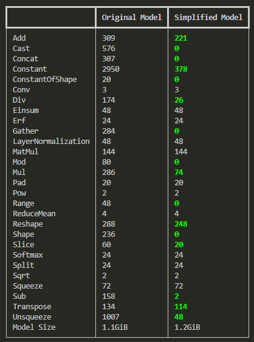

# SAM介绍

论文地址：[[2304.02643\] Segment Anything (arxiv.org)](https://arxiv.org/abs/2304.02643)

NLP的大型预训练模型通过强大的zero-shot和few-shot能力彻底改变了NLP任务的范式。这些基础模型可以推广到训练期间使用到的任务和数据之外，这种能力通常通过提示工程（prompt）来实现，其中手工制作的文本用于提示语言模型为当前任务生成有效的响应。当使用来自网络的丰富文本语料库进行扩展和训练时，这些模型的zero-shot和few-shot性能与微调模型相比出奇地好。经验趋势表明，这种行为随着模型规模、数据集大小和总训练计算的增加而改善

图像分割是计算机视觉的一个核心且普遍存在的任务。为特定任务创建的图像分割模型需要进行高度专业化的工作流程，以获得经过仔细标注的数据集。受NLP基础模型的启发，Meta AI提出了图像分割的基础模型：SAM。通过该模型，目标是使用prompt工程解决新数据分布上的一系列下游分割问题。

该项目的成功取决于三个部分：任务，模型和数据。为了达成目标，主要解决了以下三个问题：

1）什么任务可以实现zero-shot泛化

2）对应的模型架构是什么

3）哪些数据可以为该任务和模型提供支持

**任务**：提出了提示分割任务，其目标是在给定任何分割提示的情况下返回有效的分割掩码。提示只是指定在图像中分割什么，如提示可以包括识别对象的空间或文本信息。有效输出掩码的要求意味着即使提示不明确并且可能引用多个对象（例如，衬衫上的点可能表示衬衫或穿着它的人），输出也应该是合理的至少对这些对象之一进行掩码。使用提示分割任务作为预训练目标，并通过提示工程解决一般下游分割任务。

**模型：**该模型必须支持灵活的提示，需要实时摊销计算掩码以允许交互式使用，并且必须具有模糊性意识。一个简单的设计满足了所有三个约束：强大的图像encoder计算图像embedding，提示encoder嵌入提示，然后将两个信息源组合在预测分割掩码的轻量级掩码decoder中。

**数据**：最终数据集 SA-1B 包括来自 1100 万张图像的超过 1B 个掩码。 SA-1B是使用我们的数据引擎完全自动收集的，其掩码比任何现有的分割数据集多400倍。


# SAM模型导出

## 下载SAM源码

```shell
git clone git@github.com:facebookresearch/segment-anything.git
cd segment-anything; pip install -e .
pip install opencv-python pycocotools matplotlib onnxruntime onnx
```

## 下载checkpoint

Meta提供了三种不同规模的模型，分别是sam-vit-b、sam-vit-l、sam-vit-h，三者规模依次变大。b对应base，是最基础的模型，l表示large，h表示huge。在这里我们使用中等规模的模型，即sam-vit-l，下载地址为：https://dl.fbaipublicfiles.com/segment_anything/sam_vit_l_0b3195.pth

## 导出为onnx模型

在这里官方代码只支持导出prompt encoder和mask decoder，还需要导出image encoder，即vit encoder。参考[[segment-anything\]使用onnxruntime部署sam模型，速度提高30倍！_青岛哈兰德的博客-CSDN博客](https://blog.csdn.net/m0_75272311/article/details/130302448)进行vit encoder的导出。新建scripts/export_onnx_model.py文件，拷贝上述链接中内容。使用上述链接内容替换segment_anything/utils/onnx.py中内容。

```shell
python scripts/export_onnx_model.py --checkpoint sam_vit_l_0b3195.pth --model-type vit_l --output sam.onnx
# python scripts/export_onnx_model.py --checkpoint <path/to/checkpoint> --model-type <model_type> --output <path/to/output>  导出prompt encoder和mask decoder

python scripts/export_image_encoder.py --checkpoint sam_vit_l_0b3195.pth --model-type vit_l --output image_encoder.onnx
# 导出image encoder
```

使用onnxsim优化模型

```shell
pip3 install -U pip && pip3 install onnxsim
onnxsim sam.onnx sam_sim.onnx   #onnxsim  input_onnx_model   output_onnx_model
onnxsim image_encoder.onnx  image_encoder_sim.onnx
```

输出如图所示的优化结果：




把inputs输入的地方加入一个task，打进pipeline


# nndeploy部署SAM

SAM的模型包含两部分，用于生成image_embedding的vit模型和生成mask的模型。因此包含了这两部分的推理。整个pipeline的有向无环图如下：


需要构建以上5个task来组成整个pipeline：

